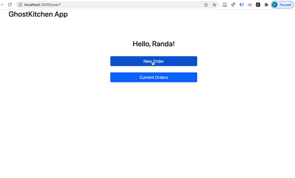

# GhostKitchen
**Team**: Katerina Bosko, Jiayi Li

In this project, we implement a database for a restaurant chain "Golden triangle" which has 5 locations across several U.S. states. The company wants to try out the new business model - ghost kitchen - meaning that the restaurants can create "virtual brands" without providing in-dining options and customers order the new menu items for takeout, drive-through and delivery only. The advantages of this model is that the restaurants can save costs, experiment with new menus and create in-house analytics.

## App



**GhostKitchen app**  was implemented using Express framework for **Node.js + SQLite + Bootstrap**.

See [GhostKitchen-II](https://github.com/k-bosko/GhostKitchen-II) and [GhostKitchen-III](https://github.com/k-bosko/GhostKitchen-III) for implementations of the same app using **MongoDB** and **Redis** respectively.

How to use the app:

1) Clone the repo and cd into `app`
2) Install the dependencies

```
npm install
```


3) Start the server

```
npm start
```

4) Point your browser to http://locahost:3000

## Database Design

To create a database, we went through the whole database creation cycle:
1. Analyzing business requirements
2. Conceptual modeling 
3. Logical modeling with Entity-Relationship Diagram (ERD)
4. Definition of a relational schema
5. Implementation of relational schema in SQLite 
6. Populating the database with test data

We also run several SQL queries (7) that could be of potential interest to "Golden Triangle":
- How many customers ordered burgers on Doordash?
- What are the virtual brands that customers give at least 30 5-star ratings?
- What are all the order ids for orders picked up by drive-through?
- Which state has most customers’ aged between 20 to 30?
- What are popular pickup types in California among young customers (age 20-30) who left a rating of at least 4 stars?
- What is the revenue per virtual brand? 

All the above steps can be found as separate files in our repository.

*Note*: we changed the name of Order table to Orders in physical implementation part because Order is a keyword in SQLite.

### Conceptual Model


### Relational Model


# Work Distribution
Jiayi Li worked on creating the Admin page and CRUD Meal table.

Katerina Bosko worked on creating th User page and CRUD Order table.

# Acknowledgement
The data for customers table was generated using [https://www.mockaroo.com/](https://www.mockaroo.com/)

This is a project for a Database Management Systems class at Northeastern University (Silicon Valley campus) taught by [John Alexis Guerra Gómez](https://github.com/john-guerra)
